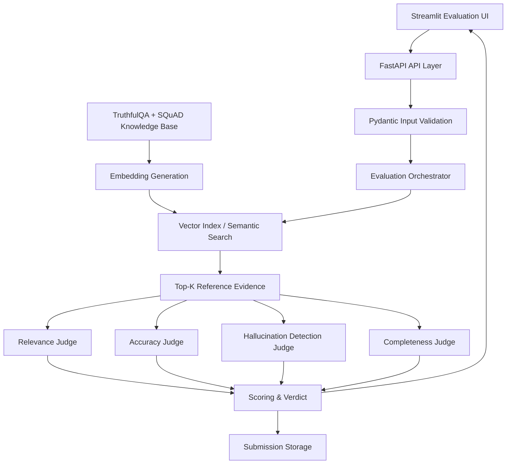

# Milestone 1 System Architecture

## Data flow
1. User enters question and AI response; reference answer/evidence is optional.
2. FastAPI validates required fields and normalizes optional fields.
3. Orchestrator retrieves top-k evidence from the benchmark/reference knowledge base.
4. Four judge agents evaluate relevance, accuracy, hallucination safety and completeness.
5. Scoring module combines the four normalized scores.
6. Verdict module applies the 0.70 baseline threshold.
7. Structured results, explanations and retrieved evidence are returned to the UI and stored.

## Components
- Evaluation Input/User Interface
- Backend/API Layer
- Evaluation Input Processing and Validation
- Submission Storage
- Benchmark Dataset Ingestion
- Cleaning and Chunking
- Embedding Generation
- Vector Index/Semantic Search
- RAG Retrieval Pipeline
- Reference Evidence Module
- Evaluation Agent Layer
- Agent Orchestrator
- Scoring and Verdict Module
- Structured Results UI

## Future extensibility
The architecture intentionally leaves extension points for an LLM-as-a-Judge, ChromaDB/FAISS or another vector database, batch evaluation, report generation, CI quality gates and monitoring in later Agile milestones.
